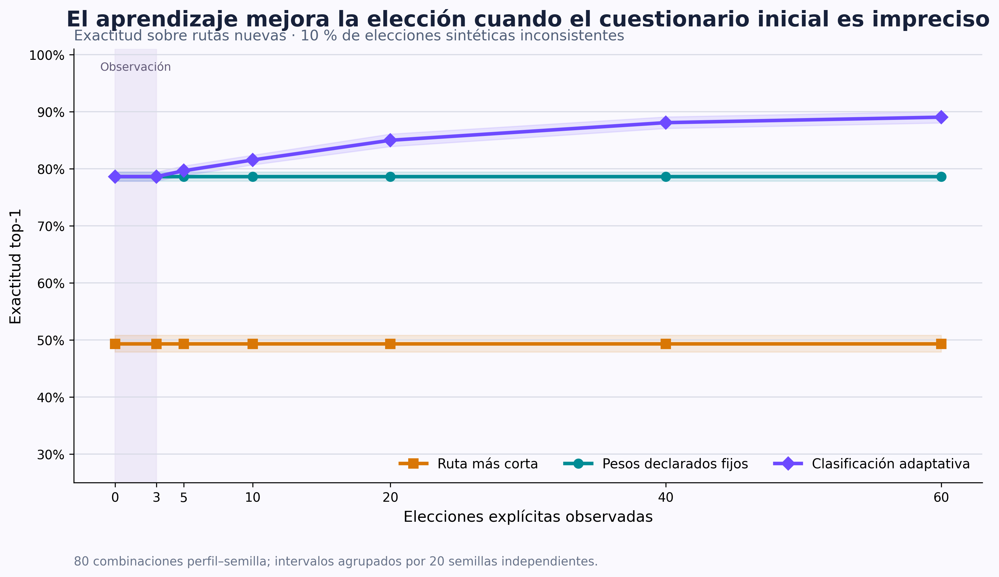
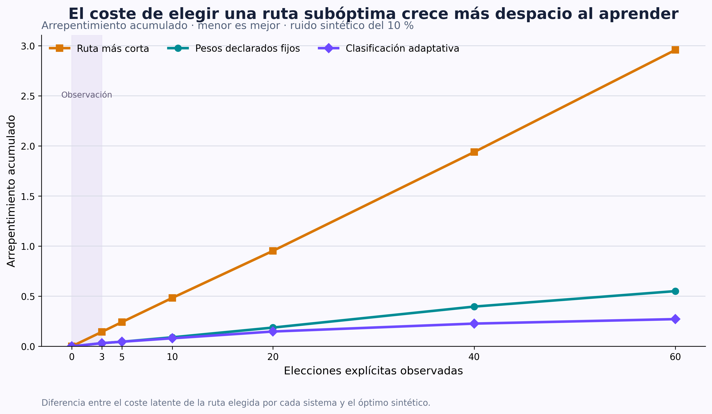

# Calibración y evaluación del aprendizaje adaptativo

Estado: `Validado`
Última actualización: 18 de agosto de 2026
Responsabilidad principal: `evaluation`
Identificador: `EXP-002`

## Pregunta de investigación

¿Un modelo de preferencias que aprende gradualmente de elecciones explícitas
ordena mejor rutas nuevas que dos sistemas de referencia —la ruta más corta y
los pesos declarados fijos— sin producir cambios bruscos ni alterar las
restricciones críticas?

Este experimento no pretende demostrar todavía que la aplicación mejora la
movilidad de personas ciegas o con baja visión. Su objetivo, más acotado, es
comprobar que el núcleo de aprendizaje recupera una preferencia conocida en un
entorno controlado, se comporta de forma estable y aporta una mejora medible
sobre el mismo punto de partida.

## Hipótesis

- **H1.** En la condición principal, donde el cuestionario contiene un 25 % de
  la señal latente, el modelo adaptativo obtendrá mayor exactitud al elegir la
  primera ruta que los pesos declarados fijos.
- **H2.** En esa misma condición, el modelo adaptativo reducirá el
  arrepentimiento medio y acumulado.
- **H3.** La ventaja se mantendrá al introducir un 10 % y un 20 % de elecciones
  sintéticas inconsistentes.
- **H4.** Los pesos seguirán siendo no negativos y sumarán uno; ningún salto
  del vector aprendido superará su límite configurado y se registrará además
  el salto efectivo que realmente interviene en la clasificación.
- **H5.** Una prueba de integración separada verificará que los pesos aprendidos
  no pueden readmitir una ruta rechazada por una restricción crítica. Las 240
  simulaciones de preferencias no contienen barreras críticas y, por tanto, no
  se usarán para estimar esa garantía.

## Sistemas comparados

| Sistema | Qué hace | Qué permite medir |
| --- | --- | --- |
| Ruta más corta | Solo pondera la distancia | Diferencia respecto a un criterio convencional sin personalización |
| Pesos declarados fijos | Mantiene el resultado aproximado del cuestionario | Valor de la personalización inicial sin aprendizaje |
| Clasificación adaptativa | Mezcla la declaración con pesos aprendidos de elecciones | Valor añadido específico del aprendizaje |

Los tres sistemas reciben exactamente los mismos conjuntos de rutas y se
evalúan con las mismas preferencias latentes. En el producto real, todos
operarían después del mismo filtro de restricciones críticas.

## Diseño del experimento

### Perfiles sintéticos

Se definieron cuatro preferencias latentes distintas. No representan tipos de
discapacidad ni perfiles clínicos; son situaciones matemáticas creadas para
comprobar si el modelo distingue señales diferentes.

Abreviaturas: D, distancia; CC, cruces complejos; AC, ayudas en cruces; EA,
evidencia de acera; E, escalones; S, superficie; O, orientación; P, pendiente;
I, incertidumbre.

| Perfil | D | CC | AC | EA | E | S | O | P | I |
| --- | ---: | ---: | ---: | ---: | ---: | ---: | ---: | ---: | ---: |
| Prioridad a distancia | 0,40 | 0,08 | 0,08 | 0,06 | 0,04 | 0,04 | 0,08 | 0,07 | 0,15 |
| Prioridad a cruces y ayudas | 0,08 | 0,25 | 0,30 | 0,07 | 0,05 | 0,03 | 0,05 | 0,05 | 0,12 |
| Prioridad a orientación y certeza | 0,08 | 0,08 | 0,10 | 0,05 | 0,04 | 0,03 | 0,32 | 0,08 | 0,22 |
| Prioridad a continuidad peatonal | 0,08 | 0,06 | 0,10 | 0,22 | 0,18 | 0,14 | 0,05 | 0,10 | 0,07 |

El cuestionario simulado no recibe estos pesos verdaderos. Su declaración
inicial contiene un 25 % de la señal latente y un 75 % de pesos uniformes:

\[
w^0=0{,}25\,w^*+0{,}75\left(\frac{1}{9},\ldots,\frac{1}{9}\right).
\]

Esta decisión representa un cuestionario informativo, pero impreciso. No se
parte de una declaración deliberadamente contraria porque eso inflaría de
forma artificial la ventaja del aprendizaje.

### Situaciones de elección

Cada situación contiene tres rutas descritas mediante nueve costes entre 0,05
y 0,95. Los valores proceden de una distribución beta simétrica y se generan
con una semilla fija. Se eliminan los conjuntos que contienen una alternativa
completamente dominada —peor o igual en todas las dimensiones—, porque elegir
entre opciones triviales aporta muy poca información sobre la importancia
relativa de los atributos.

Esta preselección hace el experimento deliberadamente informativo: mide si el
modelo aprende compensaciones cuando realmente existen. No representa la
frecuencia completa de comparaciones de una app real, donde también aparecerán
alternativas obviamente peores; se trata como una limitación externa.

La elección sintética es la ruta de menor coste según el perfil latente. Para
analizar robustez, una fracción de las elecciones se cambia aleatoriamente por
una alternativa no óptima:

- 0 %: comportamiento completamente consistente;
- 10 %: condición principal y moderadamente ruidosa;
- 20 %: condición de estrés.

El término «ruido» solo designa una inconsistencia respecto al perfil sintético
fijo. En una aplicación real, una decisión distinta puede ser perfectamente
razonable por factores contextuales que el modelo no observa.

### Separación entre calibración y evaluación

Para reducir el riesgo de ajustar los parámetros a los mismos resultados que
se presentan después:

1. La calibración usa solo tres perfiles, tres semillas y un 10 % de ruido.
2. La cuarta preferencia —continuidad peatonal— queda completamente fuera de la
   calibración.
3. La evaluación final utiliza veinte semillas nuevas y las tres condiciones
   de ruido.
4. Los conjuntos de entrenamiento y evaluación de cada ejecución tienen
   semillas distintas.

En la calibración se probaron 216 configuraciones. Cada una se ejecutó sobre
tres perfiles y tres semillas. La evaluación final contiene 240 ejecuciones:
cuatro perfiles × veinte semillas × tres niveles de ruido. Cada ejecución usa
60 elecciones de entrenamiento y 160 situaciones nuevas de evaluación.

## Hiperparámetros y criterio de selección

### Espacio explorado

| Parámetro | Valores evaluados |
| --- | --- |
| Tasa de aprendizaje \(\eta\) | 0,03; 0,06; 0,10; 0,16 |
| Sensibilidad logística \(\beta\) | 3; 6; 9 |
| Regularización \(\lambda\) | 0; 0,05; 0,15 |
| Cambio máximo \(L_1\) de los pesos aprendidos | 0,04; 0,08; 0,12 |
| Incremento de influencia | 0,05; 0,10 |

Se mantuvieron constantes tres elecciones de observación y una influencia
aprendida máxima de 0,50. El script aplica el siguiente criterio sobre la
calibración antes de ejecutar las semillas finales: mayor exactitud adaptativa
media en los puntos 10, 20, 40 y 60; en caso de empate, menor arrepentimiento
final, menor salto efectivo y configuración más conservadora. No se presenta
este orden como un prerregistro externo al repositorio.

### Cinco mejores configuraciones de calibración

| ID | \(\eta\) | \(\beta\) | \(\lambda\) | Incremento | Límite \(L_1\) | Exactitud durante el aprendizaje | Exactitud final | Arrepentimiento final |
| ---: | ---: | ---: | ---: | ---: | ---: | ---: | ---: | ---: |
| **66** | **0,06** | **3** | **0,05** | **0,10** | **0,12** | **86,08 %** | **89,67 %** | **0,00233** |
| 60 | 0,06 | 3 | 0 | 0,10 | 0,12 | 86,03 % | 88,89 % | 0,00245 |
| 84 | 0,06 | 6 | 0,05 | 0,10 | 0,12 | 85,97 % | 89,56 % | 0,00236 |
| 65 | 0,06 | 3 | 0,05 | 0,05 | 0,12 | 85,94 % | 89,67 % | 0,00233 |
| 72 | 0,06 | 3 | 0,15 | 0,10 | 0,12 | 85,86 % | 89,67 % | 0,00233 |

Las diferencias entre las primeras opciones son pequeñas. Por ello no se
afirma que la configuración 66 sea universalmente óptima: es la seleccionada
bajo este protocolo y estas semillas. Su regularización distinta de cero aporta
además una protección conceptualmente útil frente al alejamiento del perfil
declarado.

## Métricas

### Exactitud de la primera alternativa

Es la proporción de conjuntos nuevos en los que el sistema selecciona la misma
ruta que el perfil latente:

\[
\operatorname{Acc@1}=\frac{1}{N}\sum_{n=1}^{N}
\mathbf{1}[\hat r_n=r^*_n].
\]

### Exactitud por pares

Mide si el sistema ordena correctamente cada pareja posible de rutas, aunque no
coincida siempre en la primera posición. Complementa la métrica anterior y
aprovecha toda la clasificación.

### Arrepentimiento

Para una elección, es la diferencia entre el coste verdadero de la ruta
seleccionada y el mínimo disponible:

\[
R_n=C(\hat r_n\mid w^*)-\min_r C(r\mid w^*).
\]

Vale cero si se elige la mejor alternativa. Un error pequeño recibe menos
penalización que escoger una ruta mucho peor para ese perfil. El
arrepentimiento acumulado suma esta cantidad antes de cada actualización a lo
largo de las 60 elecciones.

### Estabilidad y recuperación de pesos

- Distancia \(L_1\) entre pesos efectivos y latentes.
- Mayor salto \(L_1\) del vector aprendido y mayor salto del vector efectivo
  producidos en una interacción.
- Primer punto de control —0, 3, 5, 10, 20, 40 o 60 elecciones— a partir del
  cual la exactitud permanece a menos de dos puntos porcentuales de su valor
  final.

La recuperación exacta de pesos es secundaria. Dos vectores distintos pueden
ordenar igual todas las rutas observadas; por eso la exactitud y el
arrepentimiento responden mejor a la pregunta funcional.

## Resultados finales

### Comparación global

Cada fila resume 80 combinaciones perfil–semilla —cuatro perfiles por veinte
semillas— y 12.800 situaciones nuevas por sistema y condición de ruido. Como
los cuatro perfiles comparten las rutas generadas por una misma semilla, los
intervalos se calculan sobre veinte medias agrupadas por semilla, no tratando
las 80 combinaciones como observaciones independientes.

| Ruido | Sistema | Exactitud de la primera ruta | Exactitud por pares | Arrepentimiento medio | Arrepentimiento acumulado |
| ---: | --- | ---: | ---: | ---: | ---: |
| 0 % | Ruta más corta | 49,34 % | 62,78 % | 0,05054 | 2,9580 |
| 0 % | Pesos fijos | 78,64 % | 85,27 % | 0,00902 | 0,5513 |
| 0 % | **Adaptativo** | **89,88 %** | **92,99 %** | **0,00209** | **0,2410** |
| 10 % | Ruta más corta | 49,34 % | 62,78 % | 0,05054 | 2,9580 |
| 10 % | Pesos fijos | 78,64 % | 85,27 % | 0,00902 | 0,5513 |
| 10 % | **Adaptativo** | **89,05 %** | **92,35 %** | **0,00238** | **0,2719** |
| 20 % | Ruta más corta | 49,34 % | 62,78 % | 0,05054 | 2,9580 |
| 20 % | Pesos fijos | 78,64 % | 85,27 % | 0,00902 | 0,5513 |
| 20 % | **Adaptativo** | **87,23 %** | **91,22 %** | **0,00332** | **0,3148** |

Los sistemas estáticos no cambian con el ruido porque no aprenden de las
elecciones; se incluyen en cada bloque para facilitar la comparación.

### Mejora emparejada frente a los pesos fijos

| Ruido | Mejora de exactitud | Intervalo aproximado del 95 % | Ejecuciones con mejora | Con empeoramiento |
| ---: | ---: | ---: | ---: | ---: |
| 0 % | +11,24 puntos | +9,57 a +12,91 | 74 de 80 | 6 de 80 |
| 10 % | +10,41 puntos | +9,09 a +11,72 | 76 de 80 | 4 de 80 |
| 20 % | +8,59 puntos | +6,85 a +10,34 | 72 de 80 | 8 de 80 |

Los intervalos se obtienen mediante una aproximación normal sobre las veinte
medias de diferencias agrupadas por semilla. Se ofrecen como medida de
variabilidad del simulador, no como inferencia sobre una población humana.

En la condición principal del 10 %, el arrepentimiento medio se reduce un
73,6 % respecto a los pesos fijos y el acumulado, un 50,7 %. El sistema pierde
parte de su ventaja con más decisiones inconsistentes, pero no colapsa: esta
degradación gradual es coherente con la hipótesis de robustez.

### Evolución con el número de elecciones

| Elecciones observadas | Pesos fijos | Adaptativo | Diferencia |
| ---: | ---: | ---: | ---: |
| 0 | 78,64 % | 78,64 % | 0,00 puntos |
| 3 | 78,64 % | 78,64 % | 0,00 puntos |
| 5 | 78,64 % | 79,66 % | +1,02 puntos |
| 10 | 78,64 % | 81,55 % | +2,91 puntos |
| 20 | 78,64 % | 85,00 % | +6,36 puntos |
| 40 | 78,64 % | 88,09 % | +9,45 puntos |
| 60 | 78,64 % | 89,05 % | +10,41 puntos |

La igualdad hasta la tercera elección confirma el periodo de observación. La
mejora aparece después, pero el primer punto de control que permanece próximo
al valor final tiene una mediana de 60 elecciones, precisamente el último punto
medido. En consecuencia, el sistema puede empezar a aportar valor con 5–10
decisiones, pero este experimento no demuestra que converja a las 60.



### Arrepentimiento acumulado



El arrepentimiento acumulado no debe descender: suma errores a lo largo del
tiempo. La señal positiva es que su pendiente se reduce. Después de 60
elecciones alcanza 0,272 frente a 0,551 con pesos fijos.

### Perfil no utilizado en la calibración

El perfil de continuidad peatonal pone a prueba una señal distinta de las tres
empleadas para seleccionar hiperparámetros.

| Sistema | Exactitud con 10 % de ruido | Arrepentimiento medio |
| --- | ---: | ---: |
| Ruta más corta | 40,16 % | 0,05774 |
| Pesos fijos | 83,84 % | 0,00418 |
| Adaptativo | **87,47 %** | **0,00285** |

La mejora de 3,63 puntos es menor que el promedio, pero positiva. Este resultado
reduce —sin eliminar— la preocupación de haber seleccionado parámetros que
solo funcionen en los perfiles de calibración.

### Sensibilidad a la calidad del cuestionario inicial

La condición principal supone que el cuestionario captura un 25 % de los pesos
latentes y completa el 75 % restante con una distribución uniforme. Como esa
proporción es una decisión sintética, se repitió la evaluación del 10 % de ruido
con cinco puntos de partida. Los hiperparámetros permanecieron congelados: no se
volvieron a calibrar para favorecer esta prueba.

| Señal latente presente en la declaración | Exactitud fija | Exactitud adaptativa | Diferencia adaptativa | Intervalo aproximado del 95 % |
| ---: | ---: | ---: | ---: | ---: |
| 0 % | 70,21 % | **86,63 %** | +16,41 puntos | +15,03 a +17,80 |
| 25 % | 78,64 % | **89,05 %** | +10,41 puntos | +9,09 a +11,72 |
| 50 % | 86,66 % | **89,64 %** | +2,98 puntos | +1,93 a +4,04 |
| 75 % | **93,91 %** | 89,13 % | −4,77 puntos | −5,53 a −4,02 |
| 100 % | **100,00 %** | 87,84 % | −12,16 puntos | −12,82 a −11,49 |

El aprendizaje aporta más cuando la declaración es poco informativa y pierde
ventaja a medida que el cuestionario se aproxima a la preferencia latente. Con
un perfil inicial ya muy fiel, las actualizaciones producidas por comparaciones
logísticas y un 10 % de elecciones inconsistentes degradan un orden que ya era
bueno. Este resultado negativo es importante: el modelo adaptativo no domina
universalmente al sistema fijo.

La consecuencia de diseño es mantener el aprendizaje opcional, transparente y
reversible. El núcleo se inicializa desactivado y la simulación lo activa de
forma explícita para evaluarlo. Antes de cambiar ese valor por defecto debe
estudiarse una regla conservadora que limite su influencia cuando el perfil
declarado sea estable, y esa regla debe calibrarse en datos separados. No se
modificará el algoritmo después de ver esta tabla sin registrar un experimento
nuevo. La tabla es suficiente para mostrar el punto de cruce; no se añade una
tercera figura que repita la misma relación.

### Estabilidad de los cambios

En la condición principal:

- el mayor salto observado en los pesos efectivos fue 0,0983 en distancia
  \(L_1\). El parámetro 0,12 limita el vector aprendido; que el salto efectivo
  quedara por debajo es un resultado observado, no una cota universal;
- todos los vectores permanecieron no negativos y normalizados;
- la distancia \(L_1\) media entre pesos efectivos y latentes fue 0,2439;
- las pruebas de dominio mantuvieron las restricciones críticas fuera del
  aprendizaje y verificaron cero readmisiones de rutas rechazadas.

La diferencia entre el límite 0,12 de los pesos aprendidos y el salto efectivo
observado se debe a la mezcla parcial con el perfil declarado y al calendario
de influencia seleccionado. No se interpreta la
distancia de pesos como fracaso si el orden y el arrepentimiento son buenos,
porque los parámetros no siempre son identificables de forma única.

## Interpretación

Los resultados sostienen H1 y H2 en la condición principal fijada: el modelo
adaptativo supera los dos sistemas de referencia y reduce el coste de sus
equivocaciones. La sensibilidad muestra que H1 no es una afirmación universal:
se cumple con declaraciones que contienen hasta un 50 % de la señal simulada,
pero no con perfiles iniciales muy precisos. H3 queda apoyada dentro de la
condición principal, porque la ventaja persiste con un 20 % de elecciones
inconsistentes, aunque disminuye. H4 queda respaldada por las pruebas y los
registros de saltos. H5 no procede de las 240 simulaciones: se verifica por
separado mediante la arquitectura —las restricciones se evalúan antes de que
intervengan los pesos— y una prueba de integración que intenta ordenar de nuevo
una ruta rechazada sin conseguir readmitirla.

La evidencia demuestra que existe un componente de aprendizaje automático real:
los parámetros cambian a partir de ejemplos, mejoran predicciones en conjuntos
no usados para actualizarlos y se comparan con sistemas sin aprendizaje. ORS,
OSM, GPS, TalkBack y TTS siguen siendo tecnologías auxiliares y no se confunden
con esta aportación.

## Amenazas a la validez

### Validez interna

- El simulador usa la misma forma lineal que el modelo aprende. Es una prueba
  adecuada de recuperación y de implementación, pero crea una situación
  favorable.
- La selección entre 216 configuraciones puede sobreajustar las tres semillas
  de calibración. Las veinte semillas nuevas y el cuarto perfil reducen el
  riesgo, no lo eliminan.
- El CSV de calibración conserva el agregado de las nueve ejecuciones de cada
  configuración, no las 1.944 ejecuciones intermedias. Las semillas y el script
  permiten reproducirlas, pero un análisis posterior de su variabilidad exige
  volver a ejecutar la calibración.
- Los intervalos son aproximaciones descriptivas y no corrigen comparaciones
  múltiples.

### Validez externa

- Los costes se generan de forma independiente y no reproducen todas las
  correlaciones de rutas reales; por ejemplo, distancia, pendiente y número de
  giros pueden estar relacionados.
- La exclusión de alternativas dominadas concentra la evaluación en
  comparaciones informativas y no reproduce cuántas decisiones triviales
  aparecerían en el uso real.
- La configuración se calibró con un cuestionario que contenía un 25 % de señal.
  La sensibilidad demuestra que favorece perfiles iniciales imprecisos y puede
  empeorar declaraciones ya muy fieles; no se oculta este límite.
- Los cuatro perfiles no representan la diversidad de estrategias, experiencia
  o necesidades de personas ciegas o con baja visión.
- Sesenta elecciones pueden resultar demasiadas en uso real.
- Una preferencia puede cambiar según el destino, la hora o el motivo del
  trayecto; el simulador presupone que permanece estable.
- No se han evaluado abandono, carga cognitiva ni comprensión de los cambios.

### Validez de la medida

- «Exactitud» significa coincidir con un peso latente artificial, no encontrar
  una ruta universalmente accesible.
- El arrepentimiento mide coste multicriterio, no riesgo físico.
- Una buena clasificación no garantiza recuperar los pesos verdaderos de forma
  única.
- La confianza queda fuera de la probabilidad logística y se mantiene como una
  salida independiente. La incertidumbre sí forma parte del vector de costes:
  puede influir como penalización no negativa en la preferencia, pero también
  permanece visible como salida separada y nunca se interpreta como confianza
  ni como probabilidad de seguridad.

## Reproducibilidad

Desde la raíz del repositorio, con el entorno Python 3.9 activo:

```bash
python -m ml.adaptive_preferences.evaluation
```

El script vuelve a calibrar, evalúa con semillas fijas, escribe los CSV y genera
las dos figuras mediante un backend gráfico sin interfaz. Los artefactos
versionados son:

- [`aprendizaje-calibracion.csv`](artifacts/aprendizaje-calibracion.csv): las 216 configuraciones;
- [`aprendizaje-curva.csv`](artifacts/aprendizaje-curva.csv): métricas agregadas por punto de aprendizaje;
- [`aprendizaje-ejecuciones-finales.csv`](artifacts/aprendizaje-ejecuciones-finales.csv): resultados de cada ejecución;
- [`aprendizaje-mejoras-emparejadas.csv`](artifacts/aprendizaje-mejoras-emparejadas.csv): diferencias frente a sistemas de
  referencia;
- [`aprendizaje-pesos.csv`](artifacts/aprendizaje-pesos.csv): pesos verdaderos, declarados, aprendidos y efectivos
  en la condición del 10 % de ruido;
- [`aprendizaje-resultados.csv`](artifacts/aprendizaje-resultados.csv): resumen por perfil, ruido y sistema;
- [`aprendizaje-sensibilidad-cuestionario.csv`](artifacts/aprendizaje-sensibilidad-cuestionario.csv): dependencia respecto a cinco
  calidades simuladas de la declaración inicial;
- `aprendizaje-exactitud.png` y `aprendizaje-arrepentimiento.png`: figuras.

La calibración completa tarda más que una prueba unitaria y no forma parte de
la suite rápida. Sus funciones pequeñas sí tienen pruebas deterministas.

## Conclusión

El experimento valida el funcionamiento técnico del núcleo de aprendizaje en
condiciones sintéticas y justifica continuar con la integración local en la
app. La afirmación defendible es más acotada: cuando la declaración inicial es
imprecisa —hasta un 50 % de señal en este simulador—, el sistema recupera mejor
una preferencia lineal conocida que los pesos fijos, con cambios acotados y
robustez moderada al ruido. Cuando la declaración ya es muy fiel, la adaptación
puede empeorarla. No es defendible afirmar aún que aprende las preferencias
reales de cualquier persona ni que mejora la seguridad de un recorrido físico.

## Trabajo pendiente

- [ ] Repetir el protocolo con costes observados en rutas ORS enriquecidas con
  OSM.
- [ ] Evaluar si una ventana temporal o un contexto por trayecto mejora cambios
  reales de preferencia.
- [ ] Medir comprensibilidad y control con personas usuarias.
- [ ] Revisar si 60 interacciones y el límite del 50 % son aceptables en una
  evaluación longitudinal.
- [ ] Diseñar y calibrar, en un experimento separado, una activación conservadora
  que no perjudique perfiles iniciales ya precisos.
- [ ] Definir antes del estudio con participantes el análisis estadístico y los
  criterios de exclusión.

## Referencias y evidencias

- Formulación y decisiones:
  [aprendizaje adaptativo](../research/aprendizaje-adaptativo.md).
- Código reproducible: `ml/adaptive_preferences/evaluation.py`.
- Núcleo evaluado: `backend/feedback/`.
- Pruebas: `tests/feedback/`.
- Artefactos: [`artifacts/`](artifacts/).

## Revisión previa a la publicación

- [x] La ortografía, las tildes, la puntuación y la concordancia son correctas.
- [x] Los términos técnicos están definidos y se han evitado anglicismos
  innecesarios.
- [x] El estado descrito coincide con la implementación y las pruebas reales.
- [x] El documento no contiene secretos, datos personales ni rutas locales.
