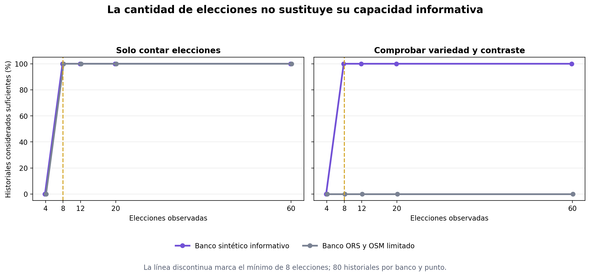

# Diagnóstico de capacidad informativa de las elecciones

Estado: `Validado`  
Última actualización: 18 de agosto de 2026  
Responsabilidad principal: `evaluation`

## Problema que resuelve

El experimento `EXP-007` mostró un límite importante: registrar muchas
elecciones no garantiza que el aprendizaje disponga de información suficiente.
En aquel banco, las mismas cuatro situaciones se repitieron hasta completar
sesenta elecciones, los cuatro perfiles sintéticos prefirieron la misma ruta en
cada situación y dos dimensiones no variaron. El modelo recibió observaciones,
pero no comparaciones capaces de identificar bien las preferencias.

El objetivo del día 4 es construir un diagnóstico previo y explicable que
responda a una pregunta más prudente que «¿el aprendizaje va a acertar?»: **¿las
comparaciones observadas contienen variedad y contrastes suficientes para
intentar generalizar?**

El diagnóstico no certifica que el aprendizaje mejore, no evalúa accesibilidad
física y no sustituye una validación con participantes. Su finalidad es detectar
casos claramente pobres antes de conceder influencia a los pesos aprendidos.

## Requisitos

- Utilizar únicamente los costes normalizados de rutas ya aceptadas.
- No utilizar coordenadas, direcciones, geometrías ni identidad personal.
- No modificar pesos, restricciones críticas ni el orden de rutas.
- Producir métricas y motivos comprensibles, no una etiqueta opaca.
- Ser determinista y reproducible con Python 3.9.
- Distinguir cantidad de elecciones de diversidad real: repetir una misma
  comparación no debe parecer evidencia nueva ilimitada.
- Mantener el aprendizaje desactivado inicialmente y reversible.

## Alternativas consideradas

| Alternativa | Ventajas | Inconvenientes | Decisión |
| --- | --- | --- | --- |
| Activar siempre después de tres elecciones | Muy simple | `EXP-007` demuestra que puede conceder influencia con señal pobre | Descartada |
| Usar solo el número de elecciones | Fácil de explicar | Sesenta repeticiones podrían superar el criterio sin aportar contextos nuevos | Descartada |
| Medir si el peso aprendido mejora sobre el mismo historial | Relacionado directamente con la pérdida | Puede premiar el sobreajuste porque entrenamiento y comprobación usan los mismos datos | Descartada para este incremento |
| Reservar una ventana de validación por persona | Permite comparar pesos fijos y aprendidos en observaciones posteriores | Necesita más interacciones, diseño longitudinal y criterios aún no calibrados | Trabajo futuro |
| Diagnóstico estructural de contrastes, variedad y rango | Es local, explicable y detecta repeticiones o dimensiones constantes | Es conservador y no demuestra por sí solo mejora futura | Adoptada para `EXP-008` |

## Decisión adoptada

Cada elección entre rutas aceptadas se transforma en una o dos diferencias de
costes. Para cada alternativa no elegida se calcula:

\[
\Delta = c_{\text{no elegida}} - c_{\text{elegida}}
\]

Cada vector tiene nueve componentes, una por dimensión de preferencia. Si una
componente es positiva, la ruta elegida tenía menor coste en esa dimensión; si
es negativa, la persona aceptó un coste mayor a cambio de otra ventaja.

El diagnóstico comprueba cinco condiciones fijadas en el script antes de
obtener el resumen final:

| Condición | Umbral inicial | Interpretación sencilla |
| --- | ---: | --- |
| Elecciones explícitas | 8 | Deben haberse observado varios contextos |
| Contraste total de un par | distancia L1 ≥ 0,10 | Se ignoran alternativas prácticamente idénticas |
| Comparaciones distintas | 12 | Repetir el mismo caso no aumenta indefinidamente la evidencia |
| Dimensiones con variación apreciable | 6 de 9 | Debe haber compensaciones en buena parte del modelo |
| Direcciones independientes | rango matricial ≥ 6 | Las diferencias no deben ser copias o combinaciones de muy pocas pautas |

La distancia L1 es la suma de las diferencias absolutas. Por ejemplo, un vector
que difiere 0,04 en distancia, 0,03 en cruces y 0,05 en superficie tiene una
distancia L1 de 0,12. El rango matricial resume cuántos patrones independientes
aparecen: muchas filas repetidas pueden elevar el contador de elecciones, pero
no el rango.

Los umbrales no se presentarán como universales. Se estudiarán sobre dos bancos
contrastados:

1. el banco sintético informativo de `EXP-002`, donde la adaptación sí mejoró;
2. el banco ORS y OSM limitado de `EXP-007`, donde la transferencia no apareció.

## Hipótesis y protocolo de `EXP-008`

### Pregunta

¿El diagnóstico distingue el banco sintético deliberadamente informativo del
banco real reducido que produjo transferencia negativa?

### Hipótesis

- H1: después de ocho elecciones, al menos el 95 % de los historiales
  sintéticos superará el diagnóstico.
- H2: ningún historial construido con el banco limitado de `EXP-007` lo
  superará, aunque se repitan hasta sesenta elecciones.
- H3: el motivo del bloqueo real incluirá dimensiones insuficientemente
  variadas o rango insuficiente, en coherencia con el análisis de `EXP-007`.

### Datos

- Cuatro perfiles sintéticos.
- Veinte semillas por banco.
- Cinco puntos de observación: 4, 8, 12, 20 y 60 elecciones.
- Un 10 % de elecciones inconsistentes, igual que en la condición principal de
  los experimentos anteriores.
- En total: 80 historiales por banco y punto de observación.

Las semillas modifican las situaciones sintéticas y el orden o ruido de las
reales. En el banco real no crean calles nuevas: todas reutilizan los cuatro
pares de aprendizaje aptos de `EXP-007`. Esta dependencia se declarará al
interpretar los porcentajes.

### Sistemas de referencia

- Regla ingenua: considerar suficiente cualquier historial al alcanzar ocho
  elecciones.
- Diagnóstico estructural: exigir conjuntamente cantidad, contraste, variedad,
  dimensiones activas y rango.

### Métricas

- Proporción de historiales considerados suficientes.
- Exactitud respecto a la etiqueta experimental de cada banco.
- Número medio de comparaciones informativas y distintas.
- Número medio de dimensiones activas.
- Rango medio de la matriz de diferencias.
- Frecuencia de cada motivo de insuficiencia.

## Datos de entrada y salida

### Entrada

- Identificadores efímeros de rutas aceptadas.
- Costes normalizados de la ruta elegida y de una o dos alternativas no
  elegidas.
- Secuencia de elecciones explícitas.

### Salida

- Resultado `suficiente` o `insuficiente`.
- Contadores de elecciones, pares informativos y comparaciones distintas.
- Lista de dimensiones con contraste.
- Rango de los vectores de diferencias.
- Lista de motivos que impiden considerar suficiente la señal.

## Implementación

Se completó en incrementos pequeños:

1. función pura `assess_signal_quality` en
   `backend/feedback/signal_quality.py`;
2. modelos validados y motivos enumerados en `backend/feedback/models.py`;
3. pruebas unitarias en `tests/feedback/test_signal_quality.py`;
4. evaluación reproducible en
   `ml/adaptive_preferences/signal_quality_evaluation.py`;
5. artefactos sanitizados bajo `docs/evaluation/artifacts/`.

La matriz es muy pequeña —como máximo nueve columnas—, por lo que el rango se
calcula de manera determinista mediante eliminación gaussiana sin introducir
una dependencia numérica adicional. Todas las dimensiones se recorren en el
mismo orden canónico que el modelo de preferencias, lo que evita desalinear un
peso con el coste equivocado.

El diagnóstico no se conecta automáticamente al ranking durante esta primera
validación. Una regla que decide cuándo influir cambia el comportamiento del
producto y debe justificarse con más de un único banco real reducido. Mientras
tanto, la protección vigente es más conservadora: aprendizaje desactivado al
inicio, activación expresa, influencia limitada, pausa y reinicio.

## Pruebas

- Un historial vacío o corto se considera insuficiente.
- Repetir muchas veces la misma comparación no satisface la diversidad.
- Diferencias casi nulas no se consideran informativas.
- Un conjunto con nueve dimensiones variadas y patrones independientes supera
  el criterio al alcanzar el mínimo de elecciones.
- El orden de las elecciones no cambia el diagnóstico estructural.
- Ejecutar el diagnóstico no modifica los pesos ni las rutas.

## Resultados

Se analizaron 800 historiales: dos bancos por cuatro perfiles, veinte semillas
y cinco puntos de observación. Cada combinación banco–punto contiene 80
historiales. En el banco sintético las semillas generan situaciones nuevas; en
el real solo cambian el orden y el ruido sobre las mismas cuatro situaciones
aptas, por lo que esas 80 combinaciones no son 80 muestras independientes de
calles.

### Resultado principal

| Banco y elecciones | Regla basada solo en cantidad | Diagnóstico estructural | Comparaciones distintas, media | Dimensiones activas, media | Rango, media |
| --- | ---: | ---: | ---: | ---: | ---: |
| Sintético, 4 | 0 % | 0 % | 8,0 | 9,0 | 8,0 |
| Sintético, 8 | 100 % | **100 %** | 16,0 | 9,0 | 9,0 |
| Sintético, 20 | 100 % | **100 %** | 40,0 | 9,0 | 9,0 |
| Sintético, 60 | 100 % | **100 %** | 120,0 | 9,0 | 9,0 |
| ORS y OSM, 4 | 0 % | 0 % | 8,0 | 5,0 | 6,0 |
| ORS y OSM, 8 | 100 % | **0 %** | 9,4 | 5,0 | 6,0 |
| ORS y OSM, 20 | 100 % | **0 %** | 11,8 | 5,0 | 6,0 |
| ORS y OSM, 60 | 100 % | **0 %** | 15,9 | 5,0 | 6,0 |

Los puntos de 12 elecciones, conservados en los CSV, mantienen el mismo patrón
y se omiten de la tabla únicamente para facilitar su lectura.

A partir de ocho elecciones, contar interacciones considera suficiente el
100 % de ambos bancos. Su exactitud sobre estas dos etiquetas contrastadas es,
por tanto, del 50 %: acierta el banco positivo y acepta incorrectamente el
negativo. El diagnóstico estructural considera suficientes todos los
historiales sintéticos y ninguno de los reales limitados desde 8 hasta 60
elecciones. En este banco concreto cumple H1 y H2 con un 100 %.

H3 también se cumple, aunque con un matiz útil. El rango real alcanza 6 y deja
de ser por sí solo un motivo de bloqueo. La causa que permanece en el 100 % de
los historiales es disponer de contraste apreciable en solo 5 de las 9
dimensiones. El número de comparaciones distintas también es insuficiente en el
95 % de los historiales reales tras 8 elecciones, pero el ruido puede invertir
alguna elección y elevar artificialmente ese contador. Incluso a las 60
elecciones, cuando la media de firmas distintas llega a 15,9, las mismas cuatro
situaciones siguen sin aportar variación en suficientes dimensiones.

### Interpretación de la figura

La figura tiene dos paneles y debe leerse de izquierda a derecha:

1. **Solo contar elecciones.** La línea vertical marca el mínimo de ocho. Al
   alcanzarlo, tanto el banco informativo como el limitado saltan al 100 %. La
   regla no sabe si se han visto ocho situaciones diferentes o repeticiones de
   cuatro casos.
2. **Comprobar variedad y contraste.** El banco sintético alcanza el 100 % al
   cumplir el mínimo, mientras que el banco real limitado permanece en 0 %.
   Añadir repeticiones hasta sesenta no corrige la falta de dimensiones
   variables.

La figura no muestra exactitud de rutas. Muestra el porcentaje de historiales
que el diagnóstico considera aptos para estudiar una posible adaptación.

### Decisión posterior al experimento

El diagnóstico se conserva como herramienta experimental y como función pura
preparada para una integración futura. **No se utiliza todavía como activador
automático de la aplicación.** Esta decisión evita sustituir una política
simple por otra aparentemente inteligente pero calibrada contra un único banco
real pequeño.

Antes de conectarlo deberán cumplirse dos condiciones adicionales:

1. repetir la evaluación con más zonas, más situaciones y comparaciones que
   representen preferencias especializadas en pocas dimensiones;
2. comprobar en una ventana posterior que los pesos aprendidos predicen mejor
   que los declarados, sin reutilizar las mismas elecciones para entrenar y
   validar.

El hallazgo sí fortalece la decisión actual de que la adaptación nazca
desactivada. Además, ofrece una explicación concreta para la defensa: no basta
con acumular clics; el sistema debe comprobar primero qué se puede aprender de
ellos.

La validación final del incremento obtuvo 282 pruebas de backend y 126 de la
aplicación. Ruff, ESLint y TypeScript finalizaron sin errores. Las diez pruebas
específicas del día 4 cubren tanto la función como la reproducción de
`EXP-008`. La aplicación no necesitó cambios, por lo que no se requiere una
comprobación manual nueva en Android para cerrar este día.

## Riesgos y limitaciones

- Los umbrales iniciales son una decisión de diseño, no valores clínicos.
- Un historial puede ser variado y aun así contener elecciones incoherentes.
- Un historial especializado en pocas dimensiones puede ser útil para una
  persona concreta y ser bloqueado por un criterio conservador.
- Superar el diagnóstico significa «hay estructura que estudiar», no «el
  aprendizaje mejorará».
- El banco real negativo es pequeño y procede de una sola zona.
- La etiqueta positiva sintética favorece situaciones creadas expresamente con
  compensaciones entre las nueve dimensiones.
- La separación perfecta se obtiene sobre los mismos dos tipos de banco que
  motivaron el diseño; no es una estimación de rendimiento poblacional.
- El criterio de seis dimensiones puede bloquear a una persona cuyas
  preferencias legítimas se concentren en menos factores.
- El ruido puede convertir una misma comparación en dos firmas opuestas y
  aumentar el contador de variedad sin crear un contexto nuevo.

## Texto base para la memoria

La transferencia a rutas reales mostró que el número de interacciones no basta
para justificar la adaptación: sesenta elecciones pueden proceder de pocas
comparaciones repetidas y dejar constantes varias dimensiones. Como respuesta,
se diseñó y evaluó un diagnóstico estructural de capacidad informativa que analiza la
magnitud de las diferencias entre rutas, el número de comparaciones distintas,
las dimensiones con variación y el rango de la matriz de contrastes. El
diagnóstico no estima accesibilidad ni garantiza una mejora del modelo; actúa
como una condición técnica conservadora destinada a identificar historiales
claramente insuficientes. Sobre 80 combinaciones por banco y punto, aceptó el
100 % de los historiales sintéticos a partir de ocho elecciones y rechazó el
100 % de los historiales ORS y OSM limitados incluso después de sesenta. El
motivo estable fue que solo cinco de las nueve dimensiones variaban de forma
apreciable. La separación perfecta se interpreta como validación técnica sobre
dos bancos contrastados, no como permiso para automatizar la activación. Por
ello el diagnóstico permanece desacoplado del ranking hasta disponer de más
escenarios y de una ventana de evaluación posterior independiente.

## Trabajo pendiente

- [x] Implementar y probar el diagnóstico puro.
- [x] Ejecutar `EXP-008` y conservar resultados por historial.
- [x] Mantenerlo como instrumento experimental después de revisar los
  resultados y sus límites.
- [ ] Repetirlo con más pares, zonas y perfiles especializados.
- [ ] Evaluar una regla posterior que compare predicción fija y adaptativa en
  elecciones no utilizadas para actualizar pesos.
- [ ] Evaluar en el futuro una ventana temporal separada con elecciones de
  participantes.

## Referencias y evidencias

- [Aprendizaje adaptativo](../research/aprendizaje-adaptativo.md).
- [EXP-002: calibración sintética](calibracion-aprendizaje-adaptativo.md).
- [EXP-007: transferencia a rutas reales](evaluacion-aprendizaje-rutas-reales.md).
- [Resultados por historial](artifacts/aprendizaje-senal-historiales.csv).
- [Resumen por banco y punto](artifacts/aprendizaje-senal-resumen.csv).
- [Figura comparativa](../figures/capacidad-informativa-aprendizaje.png).
- `backend/feedback/learner.py`.
- `backend/feedback/signal_quality.py`.
- `tests/feedback/test_signal_quality.py`.
- `tests/feedback/test_signal_quality_evaluation.py`.

## Revisión previa a la publicación

- [x] La ortografía, las tildes, la puntuación y la concordancia son correctas.
- [x] Los términos técnicos están definidos y se han evitado anglicismos
  innecesarios.
- [x] El estado descrito coincide con la implementación y las pruebas reales.
- [x] El documento no contiene secretos, datos personales ni rutas locales.
