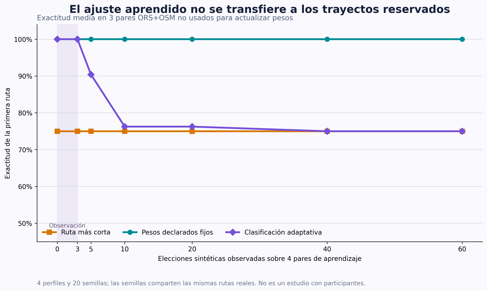

# Evaluación del aprendizaje con rutas ORS enriquecidas con OSM

Estado: `Validado`  
Última actualización: 18 de agosto de 2026  
Responsabilidad principal: `evaluation`

## Problema que resuelve

La primera evaluación del aprendizaje adaptativo utiliza vectores de costes
sintéticos. Ese diseño permite conocer de antemano las preferencias que el
modelo debería recuperar, separar calibración y evaluación y repetir exactamente
el experimento. Sin embargo, no demuestra que el aprendizaje se comporte de
forma útil cuando las alternativas presentan las relaciones y carencias que
aparecen en rutas reales.

Este experimento repite la comparación sobre rutas peatonales generadas por
OpenRouteService (ORS) y caracterizadas con una instantánea fija de
OpenStreetMap (OSM). Las rutas y sus atributos son reales; las preferencias
latentes y las elecciones continúan siendo simuladas. Esta separación permite
evaluar el núcleo matemático sin presentar el resultado como un estudio con
personas ciegas o con baja visión.

## Requisitos

- Fijar los pares origen–destino y su separación antes de observar resultados.
- Aplicar a todas las rutas el mismo proveedor, instantánea OSM, corredor de
  cinco metros, normalización y restricciones críticas.
- Aprender únicamente de alternativas que hayan superado las restricciones.
- Mantener fuera del aprendizaje las rutas descartadas.
- Comparar ruta más corta, pesos declarados fijos y pesos adaptativos.
- Conservar resultados negativos, pares con pocas rutas y dimensiones sin
  variación.
- No almacenar credenciales ni publicar geometrías completas de recorridos.
- No interpretar la exactitud simulada como eficacia con usuarios reales ni
  como probabilidad de seguridad física.

## Alternativas consideradas

| Alternativa | Ventajas | Inconvenientes | Decisión |
| --- | --- | --- | --- |
| Repetir únicamente las tres rutas Moncloa–Príncipe Pío | No requiere nuevas peticiones | Tres alternativas no identifican bien nueve preferencias y exageran la cantidad de evidencia | Descartada |
| Añadir pequeñas perturbaciones aleatorias a tres costes reales | Aumenta artificialmente el tamaño del conjunto | Los vectores dejan de corresponder a rutas observadas | Descartada |
| Usar doce pares reales y reservar cuatro para evaluación | Mantiene costes reales y permite comprobar generalización entre trayectos | Sigue siendo una muestra pequeña de una sola zona | Adoptada |
| Esperar a disponer de elecciones de participantes | Aumentaría la validez externa | Requiere protocolo ético, reclutamiento y tiempo fuera de este incremento | Trabajo futuro |

## Decisión adoptada

Se fijan doce pares públicos y reproducibles dentro de la extensión de la
instantánea OSM del área piloto. No representan domicilios ni recorridos de una
persona. Ocho se emplearán para generar las elecciones de aprendizaje y cuatro
se reservarán para medir el resultado final.

| ID | Origen (latitud, longitud) | Destino (latitud, longitud) | Uso |
| --- | --- | --- | --- |
| `rr01` | 40,4353; −3,7191 | 40,4211; −3,7206 | Aprendizaje |
| `rr02` | 40,4365; −3,7255 | 40,4195; −3,7120 | Aprendizaje |
| `rr03` | 40,4365; −3,7120 | 40,4195; −3,7255 | Aprendizaje |
| `rr04` | 40,4360; −3,7160 | 40,4195; −3,7170 | Aprendizaje |
| `rr05` | 40,4365; −3,7255 | 40,4280; −3,7120 | Aprendizaje |
| `rr06` | 40,4290; −3,7255 | 40,4195; −3,7120 | Aprendizaje |
| `rr07` | 40,4365; −3,7120 | 40,4250; −3,7240 | Aprendizaje |
| `rr08` | 40,4353; −3,7191 | 40,4195; −3,7255 | Aprendizaje |
| `rr09` | 40,4360; −3,7160 | 40,4195; −3,7120 | Evaluación |
| `rr10` | 40,4365; −3,7255 | 40,4211; −3,7206 | Evaluación |
| `rr11` | 40,4290; −3,7255 | 40,4195; −3,7170 | Evaluación |
| `rr12` | 40,4365; −3,7120 | 40,4211; −3,7206 | Evaluación |

La división es espacial y fija, no aleatoria. Una misma localización puede
aparecer en varios pares, pero ningún par completo aparece en ambos conjuntos.
Las rutas de evaluación no participan en las actualizaciones de pesos.

Cada consulta solicitará hasta tres alternativas peatonales con instrucciones
en español y evitación de escalones conocidos. Después se eliminarán
duplicados, se asociará evidencia OSM mediante el corredor calibrado de cinco
metros, se calcularán los nueve costes normalizados y se aplicarán las
restricciones críticas del perfil común de evaluación.

Un par será apto para aprendizaje o evaluación solo si conserva al menos dos
rutas aceptadas. Los pares con cero o una alternativa se mantendrán en el
archivo de costes y se comunicarán como limitación de cobertura.

## Justificación

La separación por pares origen–destino es más exigente que repartir rutas del
mismo trayecto entre entrenamiento y evaluación. Impide que el modelo aprenda
de una ruta y sea evaluado sobre otra alternativa casi idéntica del mismo
problema. También reproduce una pregunta relevante para la aplicación: si las
preferencias aprendidas en unos desplazamientos ayudan a ordenar otros
desplazamientos dentro del área piloto.

Se conservan preferencias latentes sintéticas porque proporcionan una respuesta
de referencia conocida. Sin ellas no sería posible afirmar cuál de las rutas
debería elegir un perfil, salvo realizando un estudio con participantes. Los
cuatro perfiles serán los mismos de `EXP-002` y los hiperparámetros permanecerán
congelados; no se recalibrarán sobre estas rutas.

## Datos de entrada y salida

### Entrada

- Doce pares WGS84 fijados en la tabla anterior.
- Respuestas ORS validadas y almacenadas en caché local privada.
- Instantánea OSM `moncloa_principe_pio`, consulta
  `944b1058b3aaa91f8297bf4a40c5eae2976a2bf0ef067045f06c36b98cf75a33`
  y fecha base 11 de agosto de 2026.
- Corredor espacial de cinco metros, seleccionado en `EXP-006`.
- Nueve costes normalizados del sistema de puntuación.
- Cuatro perfiles latentes y sus declaraciones parciales de `EXP-002`.
- Configuración del aprendizaje ya calibrada: tasa 0,06, sensibilidad 3,
  regularización 0,05, tres elecciones de observación, incremento de influencia
  0,10, influencia máxima 0,50 y límite L1 aprendido de 0,12.

### Salida

- `aprendizaje-rutas-reales-costes.csv`: una fila por ruta, sin geometría, con
  procedencia, aceptación, motivos de descarte y nueve costes.
- `aprendizaje-rutas-reales-ejecuciones.csv`: resultados por perfil y semilla.
- `aprendizaje-rutas-reales-resumen.csv`: comparación agregada de los tres
  sistemas.
- `aprendizaje-rutas-reales-escenarios.csv`: disponibilidad y número de
  alternativas por par, identificados por la huella SHA-256 de la consulta.
- `aprendizaje-rutas-reales-dimensiones.csv`: variación observada de cada coste.
- `aprendizaje-rutas-reales-curva.csv`: métricas en los puntos de control.
- `aprendizaje-rutas-reales-preferencias.csv`: diagnóstico de las rutas
  preferidas por cada perfil.
- `aprendizaje-rutas-reales.png`: comparación visual de la evolución de la
  exactitud en los pares reservados.

## Protocolo experimental fijado

### Sistemas de referencia

1. **Ruta más corta:** selecciona la alternativa aceptada de menor distancia.
2. **Pesos declarados fijos:** utiliza únicamente la respuesta inicial simulada
   del cuestionario.
3. **Clasificación adaptativa:** comienza con esos mismos pesos, observa tres
   elecciones sin alterar el ranking y actualiza después su componente
   aprendido.

### Elecciones simuladas

En cada interacción se seleccionará uno de los ocho pares de aprendizaje que
tengan dos o tres rutas aceptadas. La ruta preferida será la de menor coste bajo
los pesos latentes conocidos. En la condición principal, un 10 % de elecciones
será deliberadamente inconsistente para representar variabilidad humana sin
afirmar que ese porcentaje proceda de usuarios reales.

Se realizarán 60 elecciones por perfil y semilla. Las semillas finales serán
`2026081901` a `2026081920`. Cambiarán el orden de presentación y las elecciones
inconsistentes, pero no las rutas reales ni la división entrenamiento–evaluación.
Estos números son identificadores deterministas del experimento, no fechas de
ejecución ni marcas temporales.

### Métricas

- Exactitud de la primera ruta en los cuatro pares reservados.
- Exactitud de las comparaciones por pares.
- Arrepentimiento medio: coste latente adicional de la ruta seleccionada frente
  a la mejor ruta aceptada.
- Resultado por perfil, además de la media conjunta.
- Número de pares aptos y rutas aceptadas o descartadas.
- Diversidad de cada dimensión: rango y desviación de sus costes.
- Máximo salto de pesos aprendido y efectivo.
- Violaciones críticas observadas: el objetivo es cero rutas descartadas
  utilizadas para aprender o evaluar.

Los intervalos, si se calculan, agruparán por las veinte semillas. No se tratarán
los cuatro perfiles evaluados sobre las mismas rutas como observaciones
independientes.

### Criterio de interpretación

El resultado se considerará evidencia favorable de transferencia al dominio
real si la clasificación adaptativa supera en media a los pesos declarados
fijos en rutas reservadas y reduce el arrepentimiento sin utilizar rutas
descartadas. Un empate o empeoramiento también será un resultado válido: puede
indicar que hay pocos pares informativos, que los atributos apenas varían o que
el cuestionario ya determina correctamente el orden.

No se seleccionarán nuevos hiperparámetros después de ver este resultado. Por
tanto, el experimento evalúa la configuración de `EXP-002` en otro tipo de
entrada y no constituye una segunda calibración.

## Implementación

- Módulo previsto: `ml/adaptive_preferences/real_routes_evaluation.py`.
- Reutilización de `compute_route_costs`, `rank_routes`,
  `initialize_learning` y `update_preferences`.
- Cachés externas privadas bajo `data/raw/`; tabla derivada sanitizada bajo
  `docs/evaluation/artifacts/`.
- Pruebas deterministas con datos mínimos que no requieren red.

El módulo reutiliza el cliente ORS, la instantánea OSM, las restricciones y la
misma función de costes que utiliza la aplicación. La recopilación emplea una
caché exclusiva para este experimento, sin eliminar la caché histórica de la
app. Así se comprobó que las 31 rutas recibidas usan el motor ORS 9.9.0 y el
mismo grafo, fechado el 10 de agosto de 2026.

El CSV público contiene solo costes derivados, identificadores, procedencia y
motivos de descarte. No conserva coordenadas, geometrías, nombres de calles ni
la clave de ORS. El fichero privado de caché permanece bajo `data/raw/`.

## Pruebas

- Los doce identificadores y pares deben ser únicos y quedar dentro del área.
- Ninguna ruta descartada puede aparecer en una elección.
- Los pares con menos de dos rutas aceptadas no generan aprendizaje.
- La separación entrenamiento–evaluación no puede solaparse.
- Las semillas reproducen exactamente el orden y el ruido.
- Los tres sistemas usan las mismas rutas aceptadas.
- La tabla derivada no contiene geometría, coordenadas, nombres de calles ni
  credenciales.
- Los pesos permanecen normalizados y no negativos.

## Resultados

### Disponibilidad de alternativas

ORS devolvió 31 rutas válidas en once de los doce pares. Tras el enriquecimiento
y las restricciones, 24 fueron aceptadas y 7 descartadas. Un par produjo una
respuesta HTTP correcta pero internamente incoherente: la geometría tenía 98
puntos y una referencia de información adicional llegaba al índice 106. Se
registró `invalid_response` y no se relajó la validación.

| Partición | Pares fijados | Pares con respuesta válida | Pares aptos, con 2 o más rutas aceptadas |
| --- | ---: | ---: | ---: |
| Aprendizaje | 8 | 7 | 4 |
| Evaluación | 4 | 4 | 3 |
| Total | 12 | 11 | 7 |

Los pares no aptos se conservaron como evidencia: `rr02`, `rr05` y `rr12`
mantuvieron una ruta aceptada; `rr06`, ninguna; y `rr04` fue la respuesta
incoherente. No se sustituyeron por otros pares después de observar el resultado.

### Resultado después de 60 elecciones

Las veinte semillas cambian el orden y el 10 % de elecciones inconsistentes,
pero comparten los mismos pares reales. Por eso los intervalos se agrupan por
semilla y no se interpretan las 80 combinaciones perfil–semilla como calles
independientes.

| Sistema | Exactitud de la primera ruta | Exactitud por pares | Arrepentimiento medio |
| --- | ---: | ---: | ---: |
| Ruta más corta | 75,00 % | 80,56 % | 0,00525 |
| Pesos declarados fijos | **100,00 %** | **97,22 %** | **0,00000** |
| Clasificación adaptativa | 75,00 % | 84,31 % | 0,00525 |

El adaptativo no supera al sistema fijo: pierde 25 puntos porcentuales en la
primera posición y acaba igualando a la ruta más corta en esa métrica. En
exactitud por pares conserva una pequeña ventaja sobre la ruta más corta, pero
sigue 12,92 puntos por debajo de los pesos fijos. El resultado contradice la
transferencia esperada y se conserva íntegramente.

### Resultado por perfil

| Perfil sintético | Ruta más corta | Pesos fijos | Adaptativo |
| --- | ---: | ---: | ---: |
| Prioridad a distancia | 100,00 % | 100,00 % | 100,00 % |
| Prioridad a ayudas en cruces | 66,67 % | 100,00 % | 66,67 % |
| Prioridad a orientación | 66,67 % | 100,00 % | 66,67 % |
| Prioridad a continuidad peatonal | 66,67 % | 100,00 % | 66,67 % |

### Evolución

| Elecciones observadas | Pesos fijos | Adaptativo |
| ---: | ---: | ---: |
| 0 | 100,00 % | 100,00 % |
| 3 | 100,00 % | 100,00 % |
| 5 | 100,00 % | 90,42 % |
| 10 | 100,00 % | 76,25 % |
| 20 | 100,00 % | 76,25 % |
| 40 | 100,00 % | 75,00 % |
| 60 | 100,00 % | 75,00 % |

La figura 10 representa esa relación. Las tres curvas coinciden con su estado
inicial durante el periodo de observación. Después, la curva adaptativa
desciende: más interacciones no reparan la falta de diversidad informativa del
conjunto de aprendizaje, sino que refuerzan el mismo patrón local.

### Por qué ocurre

El diagnóstico de preferencias muestra que, en cada uno de los cuatro pares de
aprendizaje aptos, los cuatro perfiles latentes prefieren exactamente la misma
ruta. Hay variedad numérica de costes, pero no hay variedad en la etiqueta que
el modelo observa. En `rr01`, `rr07` y `rr08` todos eligen la ruta 1; en `rr03`,
todos eligen la ruta 2. El algoritmo aprende de esas elecciones comunes, no
puede deducir qué diferencia a los perfiles y traslada ese patrón a los pares
reservados.

En evaluación, `rr09` sí exige distinguir perfiles: el de distancia prefiere la
ruta 2 y los otros tres, la ruta 3. Los pesos fijos ya resuelven correctamente
ese caso y todas las primeras posiciones reservadas. Por tanto, el experimento
tiene además un efecto techo: el sistema de referencia no deja margen de mejora.

Dos costes tampoco aportan señal en esta muestra: complejidad de orientación
vale 1 en las 24 rutas aceptadas y pendiente vale 0,5. No se puede aprender la
importancia de una dimensión que permanece constante. Esto explica por qué un
resultado sintético positivo no garantiza transferencia automática a un
conjunto pequeño de rutas correlacionadas.

### Decisión derivada

Se mantiene el aprendizaje como función opcional, local, reversible y
desactivada inicialmente. No se cambian los hiperparámetros después de ver este
resultado. Antes de defender una activación más amplia será necesario recopilar
comparaciones reales que enfrenten compensaciones distintas y evaluar si cada
dimensión es observable. Los pesos declarados fijos constituyen el modo seguro
de referencia cuando la señal disponible no es informativa.

## Interpretación detallada para la memoria y la defensa

La clave es explicar que «aprendizaje desactivado» no significa que la
aplicación deje de ser personalizada. Significa que utiliza exclusivamente las
preferencias que la persona declaró inicialmente, que en este experimento ya
eran suficientes para ordenar correctamente una muestra muy pequeña.

### Respuesta breve para el tribunal

> La aplicación sigue siendo útil sin aprendizaje adaptativo porque compara
> rutas reales usando el perfil declarado, restricciones críticas, evidencia
> OSM, incertidumbre y explicaciones. El aprendizaje es una mejora opcional
> destinada a corregir perfiles iniciales imprecisos. En el experimento
> sintético mostró capacidad para hacerlo, pero en el conjunto reducido de
> rutas reales no recibió elecciones suficientemente variadas para distinguir
> los perfiles y empeoró el resultado. Por eso no se activa automáticamente.
> Este resultado negativo permitió identificar cuándo no debe aprender el
> sistema y condujo a una decisión de diseño más segura.

### Qué significa realmente «desactivarlo»

Con el aprendizaje desactivado, la app no se convierte en un navegador
convencional. Continúa haciendo todo esto:

1. La persona declara qué características le importan.
2. La aplicación obtiene rutas reales de ORS.
3. Las enriquece con información de accesibilidad de OSM.
4. Descarta rutas incompatibles con restricciones críticas.
5. Ordena las rutas restantes según el perfil declarado.
6. Presenta adecuación, confianza, incertidumbre y explicaciones.
7. Proporciona instrucciones enriquecidas, GPS y recálculo confirmado.

Por tanto, existen tres niveles diferentes:

| Sistema | Personalización | Aprende de elecciones |
| --- | --- | --- |
| Ruta más corta | No | No |
| Pesos declarados fijos | Sí | No |
| Clasificación adaptativa | Sí | Sí |

El resultado no dice que la personalización sea inútil. De hecho, en el
experimento real-sintético:

- Ruta más corta: 75 %.
- Pesos declarados personalizados: 100 %.
- Adaptativo después de 60 elecciones: 75 %.

La personalización declarada fue el mejor sistema en esa muestra.

### Por qué empeoró el aprendizaje

#### 1. Los ejemplos de aprendizaje no distinguían los perfiles

Había cuatro perfiles diferentes:

- Prioridad a la distancia.
- Prioridad a las ayudas en cruces.
- Prioridad a la orientación.
- Prioridad a la continuidad peatonal.

Sin embargo, en cada uno de los cuatro trayectos aptos para aprender, los cuatro
perfiles preferían exactamente la misma ruta.

| Trayecto de aprendizaje | Ruta elegida por distancia | Por cruces | Por orientación | Por continuidad |
| --- | --- | --- | --- | --- |
| `rr01` | Ruta 1 | Ruta 1 | Ruta 1 | Ruta 1 |
| `rr03` | Ruta 2 | Ruta 2 | Ruta 2 | Ruta 2 |
| `rr07` | Ruta 1 | Ruta 1 | Ruta 1 | Ruta 1 |
| `rr08` | Ruta 1 | Ruta 1 | Ruta 1 | Ruta 1 |

El modelo veía elecciones, pero no veía diferencias entre perfiles.

Es parecido a intentar averiguar si cuatro personas prefieren dulce o salado
ofreciéndoles solamente platos que gustan a las cuatro. Sus elecciones no
permiten descubrir qué las diferencia.

#### 2. Dos características eran constantes

En las 24 rutas aceptadas:

- La complejidad de orientación tenía siempre coste 1.
- La pendiente tenía siempre coste 0,5.

Si una característica no cambia entre rutas, el modelo no puede aprender su
importancia.

Matemáticamente, comparar dos rutas con la misma pendiente produce una
diferencia igual a cero. Por mucho que una persona valore la pendiente, esa
elección no aporta información para actualizar su peso.

#### 3. El sistema fijo ya acertaba todo

En los tres trayectos reservados para evaluación, los pesos declarados acertaban
el 100 % de las primeras posiciones.

Esto se denomina efecto techo: no existe margen observable para mejorar. El
aprendizaje solo podía:

- Mantener el 100 %.
- O empeorarlo.

Además, tres trayectos constituyen una muestra demasiado pequeña. Un solo error
cambia la exactitud de un perfil en 33,3 puntos porcentuales.

#### 4. El modelo aprendió un patrón local que no se repetía

Durante el aprendizaje, elegir ciertas rutas era correcto para todos los
perfiles. El algoritmo aumentó gradualmente la importancia de las
características asociadas a esas elecciones.

Pero, en el trayecto reservado más informativo, el perfil de distancia prefería
una ruta y los otros perfiles preferían otra. El patrón aprendido no permitía
diferenciarlos.

No es que el modelo «dejara de funcionar»: actualizó los pesos siguiendo
correctamente las observaciones. El problema fue que esas observaciones no
contenían la información necesaria para generalizar.

### ¿Entonces para qué sirve el aprendizaje?

Sirve potencialmente cuando se cumplen estas condiciones:

- El cuestionario inicial representa mal las preferencias.
- Existen varias rutas aceptadas entre las que elegir.
- Las rutas presentan compensaciones reales: una es más corta, otra tiene
  mejores cruces, otra es más sencilla de seguir, etc.
- Las elecciones de la persona son suficientemente variadas.
- Las características relevantes cambian entre alternativas.
- Se dispone de varias situaciones, no solo cuatro trayectos parecidos.

Esto sí apareció en el experimento sintético controlado:

| Calidad de la declaración inicial | Pesos fijos | Adaptativo | Diferencia |
| --- | ---: | ---: | ---: |
| Sin señal de la preferencia real | 70,21 % | 86,63 % | +16,41 puntos |
| 25 % de señal | 78,64 % | 89,05 % | +10,41 puntos |
| 50 % de señal | 86,66 % | 89,64 % | +2,98 puntos |
| 75 % de señal | 93,91 % | 89,13 % | −4,77 puntos |
| Declaración exacta | 100,00 % | 87,84 % | −12,16 puntos |

Esto ofrece una conclusión más interesante que «la IA funciona» o «la IA no
funciona»:

> El aprendizaje aporta valor cuando la declaración inicial es imprecisa y las
> elecciones contienen información suficiente. Puede perjudicar el resultado
> cuando el perfil inicial ya es preciso o cuando los ejemplos no permiten
> distinguir preferencias.

### Por qué no se oculta el resultado

Para un TFM de IA, este resultado fortalece el trabajo porque demuestra que:

- Se han definido sistemas de referencia.
- Se han separado calibración y evaluación.
- Se ha probado el modelo fuera de su entorno sintético favorable.
- No se han recalibrado los parámetros después de ver un resultado negativo.
- Se ha investigado la causa, en lugar de limitarse a presentar una métrica.
- Se ha identificado un problema de identificabilidad de las preferencias.
- Se ha derivado una decisión segura de producto.

Un trabajo más débil habría mostrado únicamente el 89,05 % sintético y habría
afirmado que la IA mejora la aplicación. Esta evaluación distingue entre
funcionamiento matemático, transferencia y utilidad real.

### Por qué no se elimina directamente el aprendizaje

Eliminarlo supondría perder una contribución importante del TFM. La decisión
más razonable es mantenerlo como componente experimental y opcional porque:

- La evaluación sintética demuestra que puede recuperar una preferencia
  conocida.
- La implementación es explicable, local y reversible.
- No puede modificar restricciones críticas.
- La persona conserva el perfil declarado.
- El resultado real identifica qué datos faltan para evaluarlo adecuadamente.
- Permite plantear una evolución académica clara.

No se defiende que actualmente esté demostrado que mejora rutas reales para
personas ciegas. La formulación correcta es:

> Se ha validado el mecanismo de aprendizaje en condiciones controladas y se ha
> comprobado su integración segura. Su transferencia no se observó en el
> pequeño conjunto de rutas reales empleado, debido a falta de diversidad
> informativa y a un efecto techo del perfil fijo.

### Decisión de producto derivada

La app ya aplica varias protecciones coherentes con el resultado:

- El aprendizaje nace desactivado.
- La persona debe activarlo expresamente.
- Puede pausarlo.
- Puede reiniciarlo.
- Las primeras tres elecciones solo se observan.
- La influencia aprendida no supera el 50 %.
- Las restricciones críticas nunca se aprenden.
- Lo aprendido no sustituye completamente lo declarado.
- El estado permanece local en el dispositivo.

Una futura mejora especialmente defendible sería incorporar una condición de
activación basada en la calidad de la señal:

1. Comprobar si las rutas elegidas presentan diferencias suficientes.
2. Comprobar si las elecciones permiten distinguir dimensiones.
3. Mantener los pesos fijos si todas las alternativas generan la misma señal.
4. Aplicar cambios solo cuando exista evidencia de mejora.
5. Suspender la adaptación si empeora frente al perfil declarado en una ventana
   de validación.

Esto convertiría el hallazgo negativo en una futura línea de investigación:
aprendizaje adaptativo condicionado por la capacidad informativa de las
elecciones.

### Preguntas que podría plantear el tribunal

#### «¿Para qué sirve la IA si el sistema fijo es mejor?»

> En esta muestra concreta, el cuestionario inicial ya resolvía todas las
> primeras posiciones y los ejemplos de aprendizaje no distinguían los
> perfiles. La IA sirve para corregir declaraciones imprecisas cuando existen
> elecciones informativas, como demuestra la evaluación controlada. Al
> comprobar que esas condiciones no se cumplen en el banco real reducido, la
> aplicación conserva el sistema fijo y no activa automáticamente el
> aprendizaje.

#### «¿No demuestra esto que el modelo está mal diseñado?»

> No. Las pruebas verifican el signo del gradiente, la normalización, los
> límites, la reproducibilidad y la paridad entre Python y TypeScript. El modelo
> actualiza correctamente según los datos recibidos. El problema es
> estadístico: las observaciones no identifican las diferencias entre perfiles.
> Un algoritmo no puede aprender una distinción que no aparece en los ejemplos.

#### «¿Por qué el experimento sintético mejora y el real no?»

> El sintético fue diseñado para contener compensaciones entre dimensiones y
> comprobar si el algoritmo recuperaba pesos conocidos. Las rutas reales están
> correlacionadas, varias fueron descartadas y algunas dimensiones no variaron.
> El experimento sintético valida el algoritmo; el real estudia su transferencia
> y revela las limitaciones de los datos disponibles.

#### «¿El 100 % de los pesos fijos significa que la app ya funciona perfectamente?»

> No. Son tres pares reservados aptos y preferencias sintéticas. Un error
> cambiaría mucho el porcentaje. El resultado indica que el sistema fijo acertó
> esa pequeña muestra, no que tenga un 100 % de eficacia con personas o en
> Madrid.

#### «¿Qué se haría con más tiempo?»

> Se ampliaría el número y la diversidad de pares, se generarían más candidatas,
> se seleccionarían comparaciones con compensaciones observables, se evitarían
> dimensiones constantes y se realizaría una evaluación longitudinal con
> participantes y consentimiento. También se estudiaría una regla que solo
> permita adaptar cuando las elecciones contengan señal suficiente.

La defensa más sólida no consiste en intentar demostrar que el aprendizaje ya
mejora la aplicación. Consiste en mostrar que la app ya aporta personalización
sin depender de él y que la evaluación de IA ha identificado rigurosamente
cuándo la adaptación puede ayudar y cuándo debe mantenerse desactivada.

## Riesgos y limitaciones

- Doce pares de una sola zona no representan Madrid ni otras ciudades.
- Las rutas proceden del grafo ORS disponible al descargarlas y no constituyen
  todos los caminos peatonales posibles.
- La instantánea OSM puede omitir atributos o contener errores; lo desconocido
  se mantiene como coste e incertidumbre.
- Las elecciones sintéticas siguen una función lineal de la misma familia que
  el modelo y no reproducen toda la decisión humana.
- Veinte semillas cambian la simulación, pero comparten los mismos doce pares;
  no equivalen a veinte muestras independientes de calles.
- La posición de una ruta bajo pesos latentes sintéticos no certifica su
  accesibilidad física.
- Si ciertas dimensiones no varían entre rutas, sus pesos no serán
  identificables con este conjunto.
- Solo cuatro pares de aprendizaje y tres de evaluación conservaron dos o más
  alternativas; la precisión porcentual cambia mucho con un solo trayecto.
- Los cuatro perfiles produjeron la misma elección en todos los pares de
  aprendizaje aptos, de modo que el conjunto no identifica diferencias entre
  perfiles.
- Orientación y pendiente fueron constantes; el experimento no evalúa la
  capacidad de aprenderlas.
- El 100 % del sistema fijo es un efecto techo sobre tres pares, no una
  estimación general de eficacia.
- Las veinte semillas miden variación de orden y ruido sobre las mismas rutas;
  no representan veinte muestras nuevas del entorno.

## Texto base para la memoria

Tras validar el aprendizaje sobre costes sintéticos, se ejecutó una segunda
evaluación con alternativas peatonales generadas por ORS y enriquecidas con una
instantánea fija de OSM. Se fijaron doce pares origen–destino antes de observar
los resultados; ocho se reservaron para simular elecciones de aprendizaje y
cuatro para evaluar la transferencia a trayectos no utilizados durante las
actualizaciones. Finalmente, solo cuatro pares de aprendizaje y tres de
evaluación conservaron al menos dos alternativas aceptadas. Las preferencias
latentes se mantuvieron sintéticas para
disponer de una respuesta de referencia conocida, por lo que el experimento no
se interpretó como una prueba con usuarios. Los hiperparámetros se congelaron a
partir de la calibración previa y se compararon ruta más corta, preferencias
declaradas fijas y clasificación adaptativa. Todas las alternativas se
sometieron antes a las mismas restricciones críticas y ninguna ruta descartada
participó en el aprendizaje. El sistema fijo obtuvo un 100 % de exactitud de la
primera posición en los pares reservados, mientras que la clasificación
adaptativa descendió al 75 % después de 60 elecciones. El diagnóstico mostró
que los cuatro perfiles escogían la misma ruta en todos los pares de
aprendizaje aptos y que orientación y pendiente eran constantes. Por tanto, el
resultado se interpretó como falta de señal identificativa y efecto techo del
sistema fijo, no como fallo ocultable ni como evidencia contra el aprendizaje
en cualquier contexto. Esta transferencia negativa justifica mantenerlo
opcional y exigir comparaciones más diversas antes de generalizarlo.

## Trabajo pendiente

- [x] Implementar la extracción sanitizada de costes.
- [x] Descargar las doce respuestas ORS en una caché experimental homogénea.
- [x] Ejecutar el enriquecimiento con la instantánea OSM fija.
- [x] Ejecutar las veinte semillas y analizar los resultados.
- [x] Incorporar resultados y limitaciones a la memoria.
- [ ] Ampliar el banco con pares informativos y más alternativas aceptadas.
- [ ] Repetir el protocolo con elecciones consentidas de participantes.

## Referencias y evidencias

- [Calibración del aprendizaje adaptativo](calibracion-aprendizaje-adaptativo.md).
- [Calibración del corredor OSM](calibracion-corredor-osm.md).
- [Generación y diversidad de rutas candidatas](../research/generacion-rutas-candidatas.md).
- [Costes sanitizados](artifacts/aprendizaje-rutas-reales-costes.csv).
- [Disponibilidad por escenario](artifacts/aprendizaje-rutas-reales-escenarios.csv).
- [Resultados por ejecución](artifacts/aprendizaje-rutas-reales-ejecuciones.csv).
- [Resumen agregado](artifacts/aprendizaje-rutas-reales-resumen.csv).
- [Variación por dimensión](artifacts/aprendizaje-rutas-reales-dimensiones.csv).
- [Curva por elecciones](artifacts/aprendizaje-rutas-reales-curva.csv).
- [Diagnóstico de preferencias](artifacts/aprendizaje-rutas-reales-preferencias.csv).
- `backend/scoring/costs.py`.
- `backend/feedback/learner.py`.

## Revisión previa a la publicación

- [x] La ortografía, las tildes, la puntuación y la concordancia son correctas.
- [x] Los términos técnicos están definidos y se han evitado anglicismos
  innecesarios.
- [x] El estado descrito coincide con la implementación y las pruebas reales.
- [x] El documento no contiene secretos, datos personales ni rutas locales.
